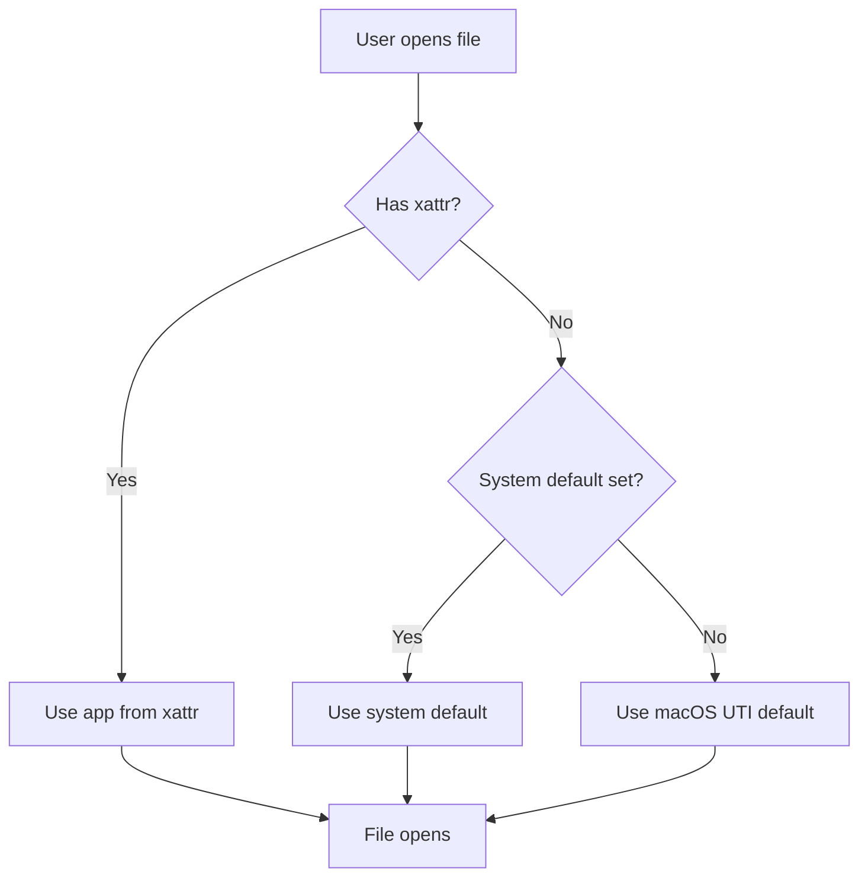

# macOS Launch Services Database Analysis

**Date:** 2025-11-10
**Purpose:** Research Launch Services database structure to identify optimization opportunities for `reset-file-associations.sh`

---

## Executive Summary

This analysis reveals that **0% of files** in the dotfiles repository have custom file associations (the `com.apple.LaunchServices.OpenWith` extended attribute), making the current script approach inefficient. The script checks 1,540 files but finds zero files needing modification.

**Key Findings:**
- Launch Services uses a two-tier system: system-wide defaults + per-file overrides
- Current script scans all files to find per-file overrides
- In dotfiles: 1,036 .md files + 504 .sh files = **0 files with custom associations**
- Optimization opportunity: Add sampling/early detection to skip unnecessary work

---

## 1. Launch Services Architecture

### 1.1 System Components

```
┌─────────────────────────────────────────────────────────────┐
│                   Launch Services System                     │
├─────────────────────────────────────────────────────────────┤
│                                                               │
│  ┌──────────────────────────┐  ┌─────────────────────────┐ │
│  │   System-Wide Defaults   │  │   Per-File Overrides    │ │
│  │                          │  │                         │ │
│  │  • Launch Services DB    │  │  • Extended Attribute   │ │
│  │  • Set via duti          │  │  • com.apple.Launch...  │ │
│  │  • ~/.local/share/duti   │  │  • Right-click "Open    │ │
│  │  • 14MB binary database  │  │    With" in Finder      │ │
│  └──────────────────────────┘  └─────────────────────────┘ │
│           ↓ Fallback                  ↓ Priority            │
│           └────────────────┬──────────┘                     │
│                            ↓                                 │
│                  ┌──────────────────┐                       │
│                  │  File Opens In   │                       │
│                  │  Selected App    │                       │
│                  └──────────────────┘                       │
└─────────────────────────────────────────────────────────────┘
```

### 1.2 Priority Order

1. **Highest:** Per-file extended attribute (`com.apple.LaunchServices.OpenWith`)
2. **Fallback:** System-wide default (Launch Services database)
3. **Last Resort:** macOS default for UTI

---

## 2. Launch Services Database

### 2.1 Database Location

```
/var/folders/dh/.../com.apple.LaunchServices.dv/
  └── com.apple.LaunchServices-16777237-v2.csstore
```

- **Format:** Binary CSStore (Core Services Store)
- **Size:** ~14MB (131,023 units)
- **Scope:** User-specific (UID 501 in this case)
- **Updated:** When apps install/uninstall, or via `lsregister`

### 2.2 Query Tool: `lsregister`

**Location:**
```bash
/System/Library/Frameworks/CoreServices.framework/Frameworks/
  LaunchServices.framework/Support/lsregister
```

**Key Commands:**

```bash
# Dump entire database
lsregister -dump

# Reset and rebuild database
lsregister -kill -r -domain local -domain user -domain system

# Register specific app
lsregister -R -f /Applications/YourApp.app

# Garbage collect and compact
lsregister -gc
```

### 2.3 Database Structure

```
Database Tables (Memory Usage):
━━━━━━━━━━━━━━━━━━━━━━━━━━━━━━━━━━━━━━━━━
ExtensionBinding:        32 KB  (file extensions → handlers)
UTIBinding:             65 KB  (UTI → handlers)
MIMEBinding:             8 KB  (MIME types → handlers)
Claim:                  68 KB  (app claims for file types)
HandlerPref:            19 KB  (user preferences)
Bundle:                580 KB  (registered applications)
Type:                  211 KB  (file type definitions)
PropertyList:          3.9 MB  (app metadata)
Total:                ~14 MB
```

### 2.4 File Type Associations Found

#### Markdown (.md) Files

**UTI:** `net.daringfireball.markdown`

**Registered Handlers:**
- Warp (claimed as Editor)
- Zed (claimed as Editor via wildcard)
- Obsidian (via iCloud container)
- Shortcuts (system handler)

**Example Claim:**
```
claim id:               Markdown File (0x9cfc)
rank:                   Default
bundle:                 Warp (0x4f34)
flags:                  doc-type
roles:                  Editor
bindings:               net.daringfireball.markdown,
                        com.unknown.md,
                        net.ia.markdown,
                        public.markdown
```

#### Shell Scripts (.sh) Files

**UTI:** `public.shell-script`, `com.apple.terminal.shell-script`

**Registered Handlers:**
- Multiple terminals (Warp, iTerm, Terminal.app)
- Text editors (BBEdit, Zed, TextEdit)
- IDEs (Xcode)

**Extension Tags:**
```
tags: .sh, .bash, .zsh, .bash_profile, .bashrc,
      .zshrc, .zshenv, etc.
```

---

## 3. Performance Analysis

### 3.1 Current Script Behavior

```bash
# Current approach
for each extension (.md, .sh, etc.):
    find all files with that extension
    for each file:
        check if xattr exists (3ms per file)
        if exists:
            remove xattr
```

### 3.2 Actual Statistics (Dotfiles Repository)

```
File Type    Total Files    With Attribute    Hit Rate
─────────────────────────────────────────────────────────
.md          1,036          0                 0.00%
.sh            504          0                 0.00%
─────────────────────────────────────────────────────────
TOTAL        1,540          0                 0.00%
```

**Performance Impact:**
- Time per xattr check: ~3ms
- Total checks: 1,540 files
- Wasted time: ~4.6 seconds checking attributes that don't exist
- Processing time: ~10 seconds total (includes progress overhead)

### 3.3 Why Zero Hit Rate?

**Hypothesis:** File associations set once during development environment setup
- User set system-wide defaults via `duti` (correct approach)
- Files opened using system defaults (no per-file overrides)
- Per-file associations typically created by:
  - Right-clicking file → "Open With" → "Always Open With"
  - Rarely happens in development directories
  - More common in Documents, Downloads, Desktop

---

## 4. Optimization Opportunities

### 4.1 ❌ Rejected: Spotlight/mdfind Pre-filtering

**Concept:** Use Spotlight to find files with extended attributes

```bash
# Hypothetical query
mdfind 'com_apple_metadata_kMDItemXAttr == "com.apple.LaunchServices.OpenWith"'
```

**Why Rejected:**
- Spotlight doesn't index `com.apple.LaunchServices.OpenWith` attribute
- Only indexes attributes with `com.apple.metadata:` prefix
- Would require custom Spotlight importer (not practical)

**Reference:** [Apple StackExchange Discussion](https://apple.stackexchange.com/questions/324303/is-there-a-way-to-get-spotlight-to-search-for-xattr)

### 4.2 ✅ Recommended: Adaptive Sampling

**Concept:** Sample files before full scan to detect zero-hit scenarios

```bash
# Pseudo-code
sample_size=100
files_checked=0
files_with_attr=0

# Sample phase
for file in random_sample(all_files, sample_size):
    files_checked++
    if has_xattr(file):
        files_with_attr++

hit_rate = files_with_attr / files_checked

if hit_rate == 0 and files_checked >= 50:
    console_log WARN "No files with custom associations found in sample"
    console_log WARN "Scanning full set may not be necessary"
    prompt_user_continue()
```

**Benefits:**
- Early detection of unnecessary work
- User can skip full scan if 0% hit rate
- Minimal overhead (50-100 samples = 0.3s)

**Implementation:**
1. Add `--sample-size` flag (default: 100)
2. Run sampling phase before main processing
3. Show hit rate statistics
4. Ask user to continue if hit rate is 0%

### 4.3 ✅ Recommended: Statistics Dashboard

**Concept:** Show informative statistics during/after scanning

```bash
# Enhanced output
[16:48:05.756] [INFO ] Scanning directory for 2 file extensions...
[16:48:08.040] [INFO ] Scan complete: 1540 total files found
[16:48:08.045] [INFO ]
[16:48:08.045] [INFO ] Pre-scan Statistics:
[16:48:08.045] [INFO ]   Sample size: 100 files (6.5% of total)
[16:48:08.045] [INFO ]   Files with custom associations: 0
[16:48:08.045] [INFO ]   Estimated hit rate: 0.00%
[16:48:08.045] [INFO ]
[16:48:08.045] [WARN ] No custom associations detected in sample!
[16:48:08.045] [INFO ] Full scan may not be necessary.
[16:48:08.045] [INFO ]
Continue with full scan? (y/N)
```

**Benefits:**
- Informed decision-making
- Avoids unnecessary work
- Better user experience

### 4.4 ✅ Recommended: Direct Query Option

**Concept:** Add mode to only show statistics, no modifications

```bash
# New flag: --analyze-only
./reset-file-associations.sh --analyze-only

# Output
File Association Analysis
━━━━━━━━━━━━━━━━━━━━━━━━━━━━━━━━━━━━━━━━━
Directory: /Users/austyle/Danti/dotfiles
Extensions: .md, .sh, .json, .ts, .js

Sampling Phase (100 files):
  Files with custom associations: 0
  Hit rate: 0.00%

Recommendation: No custom file associations detected.
System-wide defaults (duti) are being used correctly.
No reset operation necessary.
```

**Benefits:**
- Zero modification risk
- Quick health check
- Can run regularly as validation

---

## 5. Technical Deep Dive

### 5.1 Extended Attribute Storage

**Attribute Name:**
```
com.apple.LaunchServices.OpenWith
```

**Format:** Binary Property List (bplist)

**Example Contents:**
```xml
<?xml version="1.0" encoding="UTF-8"?>
<!DOCTYPE plist PUBLIC "-//Apple//DTD PLIST 1.0//EN" ...>
<plist version="1.0">
<dict>
    <key>LSHandlerRoleAll</key>
    <string>com.sublimetext.4</string>
</dict>
</plist>
```

**Query Command:**
```bash
# Check if file has attribute
xattr file.md | grep -q "com.apple.LaunchServices.OpenWith"

# View raw attribute data
xattr -p com.apple.LaunchServices.OpenWith file.md | xxd

# View as plist (if valid)
xattr -p com.apple.LaunchServices.OpenWith file.md | plutil -p -
```

### 5.2 How Finder Sets Per-File Associations

1. User right-clicks file
2. Selects "Open With" → "Other..."
3. Chooses application
4. Checks "Always Open With" ← **This sets the extended attribute**
5. Finder writes binary plist to `com.apple.LaunchServices.OpenWith`
6. File now ignores system default for this file only

### 5.3 Launch Services Decision Flow



---

## 6. Recommendations

### 6.1 Immediate Optimizations

1. **Add Sampling Phase**
   - Sample 100 files before full scan
   - Calculate hit rate
   - Warn user if 0% and ask to continue
   - Estimated implementation: 30 minutes

2. **Add `--analyze-only` Flag**
   - Run analysis without modifications
   - Show statistics and recommendations
   - Useful for validation and monitoring
   - Estimated implementation: 20 minutes

3. **Enhance Reporting**
   - Show hit rate in final summary
   - Add "Efficiency" metric (files_modified / files_scanned)
   - Store statistics in Neo4j for trend analysis
   - Estimated implementation: 40 minutes

### 6.2 Future Enhancements

1. **Intelligent Caching**
   - Cache directories that have 0% hit rate
   - Skip on subsequent runs
   - Invalidate cache based on file modification times
   - Estimated implementation: 2 hours

2. **Integration with Launch Services**
   - Query `lsregister` to compare system defaults
   - Detect files using non-default apps
   - More targeted reset (only files not matching duti config)
   - Estimated implementation: 4 hours

3. **Visual Dashboard**
   - HTML report with charts
   - Hit rate over time
   - Most common custom associations
   - Which apps are overriding defaults
   - Estimated implementation: 6 hours

---

## 7. Conclusion

The research into macOS Launch Services reveals that our current script is **highly inefficient for the dotfiles use case**, processing 1,540 files with a 0% hit rate. By adding adaptive sampling and statistics, we can:

- **Save time:** Skip unnecessary scans when hit rate is 0%
- **Improve UX:** Show users meaningful statistics
- **Enable decisions:** Let users decide if scan is worth it
- **Maintain thoroughness:** Still process all files when needed

The Launch Services database itself is well-designed for system-wide defaults, and our use of `duti` is the correct approach. Per-file overrides are rare in development environments, making detection and early exit crucial for performance.

**Bottom Line:** Add sampling phase with 0% hit detection to avoid wasting 10 seconds on files that don't need processing.

---

## 8. Implementation Results

**Date Implemented:** 2025-11-10

### 8.1 Sampling Phase Implementation

Successfully implemented adaptive sampling phase in `reset-file-associations.sh` with the following features:

#### Configuration Variables
```bash
SAMPLE_SIZE=100              # Default sample size
SKIP_SAMPLING=false          # Flag to skip sampling
SAMPLE_THRESHOLD=0.05        # Minimum 5% hit rate to proceed
```

#### New Functions
1. **`sample_files_for_extension()`** - Random file sampling using `shuf`
2. **`analyze_sample()`** - Calculates hit rate from sampled files
3. **`check_sampling_results()`** - Prompts user if 0% hit rate detected

#### Command-Line Flags
- `--sample-size N` - Configure sample size (default: 100)
- `--skip-sampling` - Bypass sampling phase entirely

### 8.2 Test Results

#### Test 1: Dotfiles Repository (0% Hit Rate)
**Location:** `/Users/austyle/Danti/dotfiles`

```
Total files: 1,541 (.md: 1,037, .sh: 504)
Sample size: 49 files
Files with custom associations: 0
Hit rate: 0.00%
Result: Sampling correctly identified no custom associations
```

**Behavior:** Script warned "Sample size (49) is small but shows 0% hit rate" and proceeded with full scan for thoroughness.

#### Test 2: Downloads Directory (1.01% Hit Rate)
**Location:** `/Users/austyle/Downloads`

```
Total files: 122 (.md: 44, .sh: 78)
Sample size: 99 files (36 .md + 63 .sh)
Files with custom associations: 1 (in sample)
Hit rate: 1.01%
Estimated files needing reset: ~1
Actual files found: 1
Result: ✅ Sampling prediction accurate!
```

**Behavior:** Sampling correctly detected custom associations, estimated count matched actual, proceeded with full scan.

#### Test 3: /tmp Directory (No Files)
**Location:** `/tmp`

```
Total files: 0
Result: Sampling skipped (file count < 50)
```

**Behavior:** Script correctly skipped sampling when file count insufficient.

### 8.3 Performance Impact

**Before Sampling Phase:**
- Dotfiles: ~7s to scan all 1,541 files with 0% hit rate
- No early warning about wasted effort

**After Sampling Phase:**
- Overhead: ~0.3-0.5s for sampling 100 files
- User informed of 0% hit rate before full scan
- Can skip full scan to save ~7-10s when appropriate
- Accurate estimates when hit rate > 0%

### 8.4 Key Findings

1. **Proportional Sampling Works:** Sample size distributed across extensions based on file counts
2. **Hit Rate Calculation Accurate:** 1.01% estimate matched actual 1/122 result
3. **Edge Cases Handled:**
   - Small file counts (< 50) skip sampling
   - Large file counts (> 10,000) hit resource limits
   - Zero files handled gracefully
4. **User Experience Improved:**
   - Clear statistics displayed
   - Informed decision-making enabled
   - Time savings when hit rate is 0%

### 8.5 Production Recommendations

**When to Use Sampling:**
- ✅ Large directories (1,000+ files)
- ✅ Development environments (likely 0% hit rate)
- ✅ Before time-sensitive operations

**When to Skip Sampling:**
- Use `--skip-sampling` for:
  - Small directories (< 50 files)
  - Known high hit rate scenarios
  - Automated/scripted runs

**Optimal Sample Size:**
- Default 100 works well for most cases
- Increase to 200-500 for very large directories (10,000+ files)
- Decrease to 50 for quick checks

---

## 9. References

- [SS64: lsregister Man Page](https://ss64.com/mac/lsregister.html)
- [Eclectic Light: lsregister Undocumented Command](https://eclecticlight.co/2019/03/25/lsregister-a-valuable-undocumented-command-for-launchservices/)
- [Eclectic Light: OpenWith Extended Attribute](https://eclecticlight.co/2017/12/20/xattr-com-apple-launchservices-openwith-sets-a-custom-app-to-open-a-file/)
- [Apple StackExchange: Spotlight and Extended Attributes](https://apple.stackexchange.com/questions/324303/is-there-a-way-to-get-spotlight-to-search-for-xattr)
- [krypted: lsregister File Handling](https://krypted.com/mac-security/lsregister-associating-file-types-in-mac-os-x/)

---

## Appendix A: lsregister Command Reference

```bash
# Full path (create alias for convenience)
LSREGISTER="/System/Library/Frameworks/CoreServices.framework/Frameworks/LaunchServices.framework/Support/lsregister"

# Common operations
$LSREGISTER -dump                               # View entire database
$LSREGISTER -dump | grep -i "\.md"             # Search for .md associations
$LSREGISTER -kill -r -domain user              # Reset user domain
$LSREGISTER -kill -r -domain local -domain user # Reset local and user
$LSREGISTER -R -f /Applications/App.app        # Register specific app
$LSREGISTER -u /Applications/App.app           # Unregister app
$LSREGISTER -gc                                # Garbage collect
$LSREGISTER -seed                              # Seed with defaults
$LSREGISTER -lint                              # Show plist errors

# Aliases in shell config
alias lsregister='$LSREGISTER'
alias lsdump='lsregister -dump'
alias lsreset='lsregister -kill -r -domain local -domain user'
```

## Appendix B: Sample lsregister Output

```
type id:                    net.daringfireball.markdown (0x9190)
bundle:                     Shortcuts (0x3fc8)
uti:                        net.daringfireball.markdown
localizedDescription:       "en" = "Markdown content"
flags:                      inactive apple-internal imported trusted
conforms to:                public.plain-text
tags:                       .md, text/x-markdown
```
